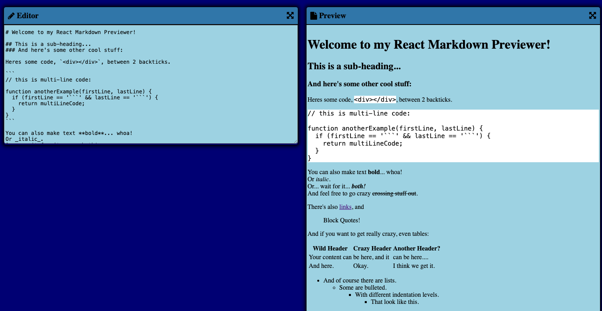

<h1 align="center">🅫 Mardown Previewer 💻</h1>

  

<h2>
This project is a markdown previewer where it is possible to type some text in the editor box and see this text converted to markdown.
</h2>

## 💻 Project

This project consists of a markdown previewer with the following funcionalities:

<ul>
  <li>
    Type text in the editor box and it will be converted to markdown in the preview box.
  </li>
  <li>
    Expand the editor and preview boxes.
  </li>
 </ul>

## 🚀 Technologies

This project was developed using the following technologies:

- React
- TypeScript
- Redux
- SASS
- Git

## 🔖 How to access it

- Download the zip file, download the modules needed with <code>npm install</code>, run <code>npm run dev</code> on the terminal and access localhost on a browser.
- [Access the final project online](https://markdown-previewer-green-eta.vercel.app/)
